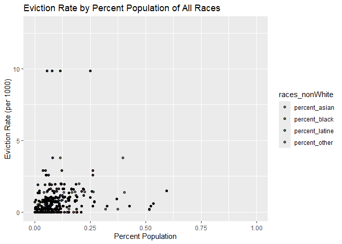
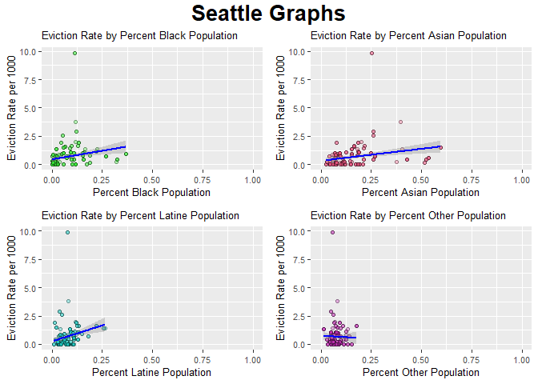
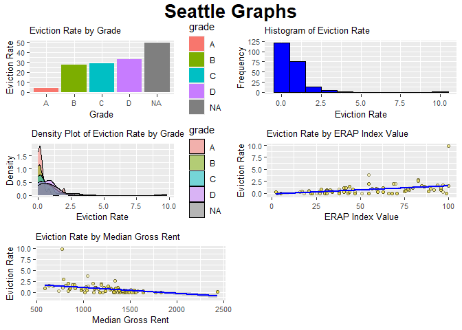
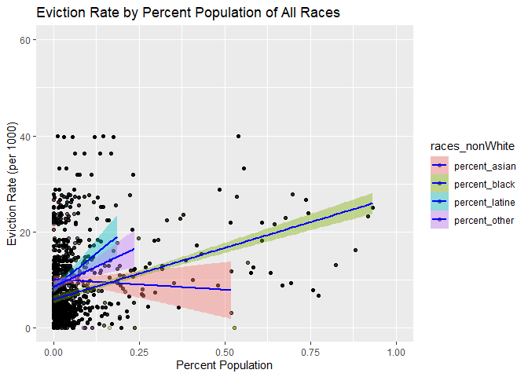
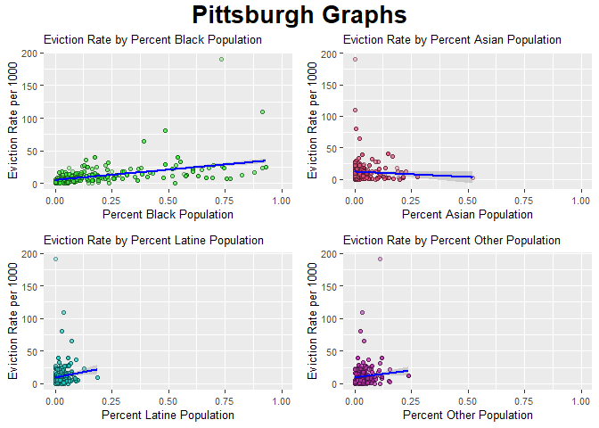
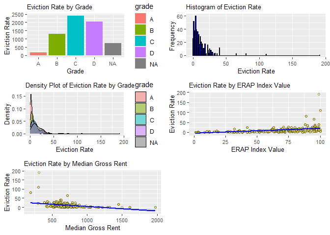

Graphs visualization
================

\##Seattle

``` r
library(tidyverse)
library(openintro)
library(httr)
library(jsonlite)
library(sf)
library(tidyverse)
library(readr)
library(readxl)
library(GGally)
library(plotly)
library(reshape2)
library(gridExtra)
library(grid)
```

``` r
# Load data
seattle <- read_sf("seattle_erap_red_evic 3.geojson")

# Handle missing values by removing rows with NAs
seattle_clean <- seattle |>
  filter(!is.na(eviction_rate) & 
           !is.na(percent_cost_burdened_renters) & 
           !is.na(median.gross.rent) & 
           !is.na(percent_black) & 
           !is.na(percent_asian) & 
           !is.na(percent_latine) & 
           !is.na(percent_other) & 
           !is.na(index_value) & 
           !is.na(year) & 
           !is.na(county_name))
```

## Including Plots

You can also embed plots, for example:

``` r
# Combine all races into a long format
seattle_long <- seattle_clean |>
  gather(key = "races_nonWhite", value = "percent_races_nonWhite", percent_black, percent_asian, percent_latine, percent_other)
# Create the combined scatter plot using Plotly
combined_plot <- ggplot(seattle_long, aes(x = percent_races_nonWhite, y = eviction_rate, fill = races_nonWhite)) +
  geom_point( alpha = 0.35, shape = 21, stroke = 0.5) +
  geom_jitter(alpha = 0.50) +
  labs(title = "Eviction Rate by Percent Population of All Races", x = "Percent Population", y = "Eviction Rate (per 1000)") +
  scale_y_continuous(limits = c(0,13)) +
  scale_x_continuous(limits = c(0, 1))

combined_plotly <- ggplotly(combined_plot)

#combined_plotly
combined_plot
```

    ## Warning: Removed 135 rows containing missing values or values outside the scale range
    ## (`geom_point()`).

<!-- -->

``` r
# Arrange the first set of plots in a grid
grid.arrange(
  arrangeGrob(
    grobs = list(plot1, plot2, plot3, plot4), 
    ncol = 2
  ),
  top = textGrob("Seattle Graphs", gp = gpar(fontsize = 20, font = 2))
)
```

    ## `geom_smooth()` using formula = 'y ~ x'
    ## `geom_smooth()` using formula = 'y ~ x'
    ## `geom_smooth()` using formula = 'y ~ x'
    ## `geom_smooth()` using formula = 'y ~ x'

<!-- -->

``` r
# Arrange the second set of plots in a grid
grid.arrange(
  arrangeGrob(
    grobs = list(plot5, plot6, plot7, plot8, plot9), 
    ncol = 2
  ),
  top = textGrob("Seattle Graphs", gp = gpar(fontsize = 20, font = 2))
)
```

    ## `geom_smooth()` using formula = 'y ~ x'
    ## `geom_smooth()` using formula = 'y ~ x'

<!-- -->

# Pittsburgh

``` r
# Load data
pittsburgh <- read_sf("pittsburgh_erap_red_evic 3.geojson")

# Handle missing values by removing rows with NAs
pittsburgh_clean <- pittsburgh |>
  filter(!is.na(eviction_rate) & 
           !is.na(percent_cost_burdened_renters) & 
           !is.na(median.gross.rent) & 
           !is.na(percent_black) & 
           !is.na(percent_asian) & 
           !is.na(percent_latine) & 
           !is.na(percent_other) & 
           !is.na(index_value) & 
           !is.na(year) & 
           !is.na(county_name))
```

``` r
# Plot 1: Scatter Plot of Eviction Rate by Percent Black Population
plot1 <- ggplot(pittsburgh_clean, aes(x = percent_black, y = eviction_rate)) +
  geom_point(color = "black", alpha = 0.35, shape = 21, stroke = 0.5, fill = "#38EB37" ) +
  labs(title = "Eviction Rate by Percent Black Population", x = "Percent Black Population", y = "Eviction Rate per 1000") +
  scale_x_continuous(limits = c(0, 1)) +
  geom_smooth(method = "lm", color = "blue") +
  theme(plot.title = element_text(size = 10), 
        axis.title = element_text(size = 10), 
        axis.text = element_text(size = 8))

# Plot 2: Scatter Plot of Eviction Rate by Percent Asian Population
plot2 <- ggplot(pittsburgh_clean, aes(x = percent_asian, y = eviction_rate)) +
  geom_point(color = "black", alpha = 0.35, shape = 21, stroke = 0.5, fill = "#E7507C" ) +
  labs(title = "Eviction Rate by Percent Asian Population", x = "Percent Asian Population", y = "Eviction Rate per 1000") +
  scale_x_continuous(limits = c(0, 1)) +
  geom_smooth(method = "lm", color = "blue") +
  theme(plot.title = element_text(size = 10), 
        axis.title = element_text(size = 10), 
        axis.text = element_text(size = 8))

# Plot 3: Scatter Plot of Eviction Rate by Percent Latine Population
plot3 <- ggplot(pittsburgh_clean, aes(x = percent_latine, y = eviction_rate)) +
  geom_point(color = "black", alpha = 0.35, shape = 21, stroke = 0.5, fill = "#1ECCC4" ) +
  labs(title = "Eviction Rate by Percent Latine Population", x = "Percent Latine Population", y = "Eviction Rate per 1000") +
  scale_x_continuous(limits = c(0, 1)) +
  geom_smooth(method = "lm", color = "blue") +
  theme(plot.title = element_text(size = 10), 
        axis.title = element_text(size = 10), 
        axis.text = element_text(size = 8))

# Plot 4: Scatter Plot of Eviction Rate by Percent Other Population
plot4 <- ggplot(pittsburgh_clean, aes(x = percent_other, y = eviction_rate)) +
  geom_point(color = "black", alpha = 0.35, shape = 21, stroke = 0.5, fill = "#C12FB3" ) +
  labs(title = "Eviction Rate by Percent Other Population", x = "Percent Other Population", y = "Eviction Rate per 1000") +
  scale_x_continuous(limits = c(0, 1)) +
  geom_smooth(method = "lm", color = "blue") +
  theme(plot.title = element_text(size = 10), 
        axis.title = element_text(size = 10), 
        axis.text = element_text(size = 8))

# Plot 5: Bar Plot of Eviction Rate by Grade
plot5 <- ggplot(pittsburgh_clean, aes(x = grade, y = eviction_rate, fill = grade)) +
  geom_bar(stat = "identity") +
  labs(title = "Eviction Rate by Grade", x = "Grade", y = "Eviction Rate") +
  theme(plot.title = element_text(size = 10), 
        axis.title = element_text(size = 10), 
        axis.text = element_text(size = 8))

# Plot 6: Histogram of Eviction Rate
plot6 <- ggplot(pittsburgh_clean, aes(x = eviction_rate)) +
  geom_histogram(binwidth = 1, fill = "blue", color = "black") +
  labs(title = "Histogram of Eviction Rate", x = "Eviction Rate", y = "Frequency") +
  theme(plot.title = element_text(size = 10), 
        axis.title = element_text(size = 10), 
        axis.text = element_text(size = 8))

# Plot 7: Density Plot of Eviction Rate
plot7 <- ggplot(pittsburgh_clean, aes(x = eviction_rate, fill = grade)) +
  geom_density(alpha = 0.5) +
  labs(title = "Density Plot of Eviction Rate by Grade", x = "Eviction Rate", y = "Density") +
  theme(plot.title = element_text(size = 10), 
        axis.title = element_text(size = 10), 
        axis.text = element_text(size = 8))

# Plot 8: Scatter Plot of Eviction Rate by ERAP Index Value
plot8 <- ggplot(pittsburgh_clean, aes(x = index_value, y = eviction_rate)) +
  geom_point(color = "black", alpha = 0.35, shape = 21, stroke = 0.5, fill = "#EBDC49" ) +
  labs(title = "Eviction Rate by ERAP Index Value", x = "ERAP Index Value", y = "Eviction Rate") +
   geom_smooth(method = "lm", color = "blue") +
  theme(plot.title = element_text(size = 10), 
        axis.title = element_text(size = 10), 
        axis.text = element_text(size = 8))

# Plot 9: Scatter Plot of Eviction Rate by Median Gross Rent
plot9 <- ggplot(pittsburgh_clean, aes(x = median.gross.rent, y = eviction_rate)) +
  geom_point(color = "black", alpha = 0.35, shape = 21, stroke = 0.5, fill = "#EBDC49" ) +
  labs(title = "Eviction Rate by Median Gross Rent", x = "Median Gross Rent", y = "Eviction Rate") +
  geom_smooth(method = "lm", color = "blue") +
  theme(plot.title = element_text(size = 10), 
        axis.title = element_text(size = 10), 
        axis.text = element_text(size = 8))
```

``` r
# Combine all races into a long format
pittsburgh_long <- pittsburgh_clean |>
  gather(key = "races_nonWhite", value = "percent_races_nonWhite", percent_black, percent_asian, percent_latine, percent_other)

# Create the combined scatter plot using Plotly
combined_plot <- ggplot(pittsburgh_long, aes(x = percent_races_nonWhite, y = eviction_rate, fill = races_nonWhite)) +
  geom_point(alpha = 0.35, shape = 21, stroke = 0.5) +
  geom_jitter(alpha = 0.50) +
  labs(title = "Eviction Rate by Percent Population of All Races", x = "Percent Population", y = "Eviction Rate (per 1000)") +
   geom_smooth(method = "lm", color = "blue") +
  scale_y_continuous(limits = c(0, 60)) +
  scale_x_continuous(limits = c(0, 1))

combined_plot
```

    ## `geom_smooth()` using formula = 'y ~ x'

    ## Warning: Removed 36 rows containing non-finite outside the scale range
    ## (`stat_smooth()`).

    ## Warning: Removed 36 rows containing missing values or values outside the scale range
    ## (`geom_point()`).

    ## Warning: Removed 181 rows containing missing values or values outside the scale range
    ## (`geom_point()`).

<!-- -->

``` r
# Arrange the first set of plots in a grid
grid.arrange(
  arrangeGrob(
    grobs = list(plot1, plot2, plot3, plot4), 
    ncol = 2
  ),
  top = textGrob("Pittsburgh Graphs", gp = gpar(fontsize = 20, font = 2))
)
```

    ## `geom_smooth()` using formula = 'y ~ x'
    ## `geom_smooth()` using formula = 'y ~ x'
    ## `geom_smooth()` using formula = 'y ~ x'
    ## `geom_smooth()` using formula = 'y ~ x'

<!-- -->

``` r
# Arrange the second set of plots in a grid
grid.arrange(
  arrangeGrob(
    grobs = list(plot5, plot6, plot7, plot8, plot9), 
    ncol = 2
  )
)
```

    ## `geom_smooth()` using formula = 'y ~ x'
    ## `geom_smooth()` using formula = 'y ~ x'

<!-- -->
